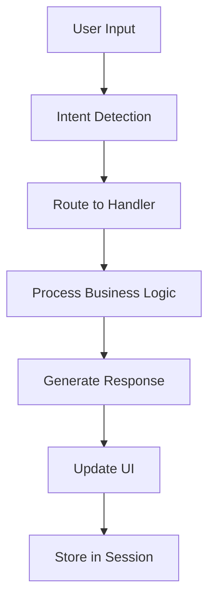

# 🏨 The Royal Marina Hotel - AI Customer Service Chatbot

<div align="center">


**A sophisticated AI-powered customer service chatbot for luxury hotel operations**

[🚀 Live Demo](#-quick-start) • [📖 Documentation](#-features) • [🛠️ Installation](#-installation) • [🤝 Contributing](#-contributing)

</div>

---

## 📋 Table of Contents

- [Overview](#-overview)
- [Features](#-features)
- [Live Demo](#-live-demo)
- [Quick Start](#-quick-start)
- [Installation](#-installation)
- [Usage](#-usage)
- [Architecture](#-architecture)
- [API Reference](#-api-reference)
- [Customization](#-customization)
- [Deployment](#-deployment)
- [Contributing](#-contributing)
- [License](#-license)

---

## 🌟 Overview

The Royal Marina Hotel Chatbot is a comprehensive customer service solution built with Python Flask and modern web technologies. It provides intelligent conversation handling, real-time booking capabilities, and seamless escalation to human agents when needed.

### 🎯 **Key Highlights**
- **Smart Intent Recognition** - Understands natural language queries
- **Complete Booking System** - End-to-end reservation management
- **Professional UI/UX** - Modern, responsive chat interface
- **Scalable Architecture** - Modular design for easy expansion
- **Production Ready** - Comprehensive error handling and logging

---

## ✨ Features

### 🤖 **Intelligent Conversation**
- **Natural Language Processing** - Regex-based intent detection
- **Context Awareness** - Maintains conversation state
- **Multi-turn Conversations** - Complex booking flows
- **Quick Replies** - Contextual button suggestions

### 🏨 **Hotel Operations**
- **Room Booking** - Interactive reservation forms
- **Availability Checking** - Real-time room status
- **Pricing Calculator** - Dynamic rate computation with taxes
- **Guest Management** - Handle 1-6 guests per booking

### 📊 **Business Intelligence**
- **Conversation Analytics** - Track user intents and behaviors
- **Booking Metrics** - Success rates and popular room types
- **Error Monitoring** - Comprehensive logging system
- **Performance Tracking** - Response times and user satisfaction

### 🎨 **User Experience**
- **Responsive Design** - Works on mobile and desktop
- **Typing Indicators** - Visual feedback during processing
- **Smooth Animations** - Professional chat experience
- **Accessibility** - WCAG compliant interface

---

## 🎬 Live Demo

### **Try the Chatbot:**
> 🔗 **Demo URL:** `https://your-username-hotel-chatbot.github.dev`

### **Sample Conversations:**
```
User: "Hello"
Bot: "Welcome to The Royal Marina Hotel! How can I assist you today?"

User: "I want to book a room for this weekend"
Bot: [Shows interactive booking form]

User: "What amenities do you have?"
Bot: [Displays amenities grid with pool, spa, restaurant, etc.]
```

---

## 🚀 Quick Start

### **Option 1: GitHub Codespaces (Recommended)**

1. **Fork this repository**
2. **Open in Codespace:**
   - Click green "Code" button
   - Select "Codespaces" tab  
   - Click "Create codespace on main"
3. **Run the application:**
   ```bash
   pip install -r requirements.txt
   python app.py
   ```
4. **Access your chatbot** at the provided URL

### **Option 2: Local Development**

```bash
# Clone the repository
git clone https://github.com/yourusername/hotel-chatbot.git
cd hotel-chatbot

# Create virtual environment
python -m venv venv
source venv/bin/activate  # On Windows: venv\Scripts\activate

# Install dependencies
pip install -r requirements.txt

# Run the application
python app.py
```

Visit `http://localhost:5000` to use the chatbot.

---

## 🛠️ Installation

### **System Requirements**
- Python 3.9 or higher
- Modern web browser
- 512MB RAM minimum
- Internet connection for CDN resources

### **Dependencies**
```txt
Flask==2.3.3
Werkzeug==2.3.7
Jinja2==3.1.2
click==8.1.7
itsdangerous==2.1.2
MarkupSafe==2.1.3
```

### **Project Structure**
```
hotel-chatbot/
├── app.py                 # Main Flask application
├── chatbot_engine.py      # Core chatbot logic
├── hotel_data.py          # Business data and rules
├── requirements.txt       # Python dependencies
├── templates/
│   └── chat.html         # Frontend interface
├── .devcontainer/
│   └── devcontainer.json # Codespaces configuration
└── README.md             # This file
```

---

## 🎮 Usage

### **Basic Interactions**

#### **Making a Reservation**
1. Say "I want to book a room" or click "Make a Reservation"
2. Fill out the booking form with dates, room type, and guests
3. Review pricing and availability
4. Confirm your booking to receive confirmation number

#### **Getting Information**
- **"What amenities do you have?"** → Shows facilities grid
- **"What room types are available?"** → Displays rooms and rates
- **"Where are you located?"** → Shows address and directions
- **"What's your cancellation policy?"** → Hotel policies

#### **Getting Help**
- **"I have a problem"** → Escalates to management
- **"I need to change my booking"** → Transfers to front desk
- **"How do I contact you?"** → Shows contact information

### **Advanced Features**

#### **Booking Flow Example**
```python
# User clicks "Make a Reservation"
# Bot shows form with:
# - Check-in date picker
# - Check-out date picker  
# - Room type dropdown (Standard $299, Deluxe $499, Presidential $899)
# - Guest count selector (1-4 guests)

# After form submission:
# - Validates dates (no past dates, checkout > checkin)
# - Checks availability (80% success rate simulation)
# - Calculates total (room rate + 15% tax + extra guest fees)
# - Shows confirmation with booking details
```

---

## 🏗️ Architecture

### **Backend Components**

#### **Flask Application (`app.py`)**
- Main web server with REST API endpoints
- Session management for conversation state
- Request/response handling for chat messages

#### **Chatbot Engine (`chatbot_engine.py`)**
```python
class HotelChatbot:
    - Intent detection using regex patterns
    - Conversation flow management
    - Response generation and formatting
    - Session state tracking
```

#### **Hotel Data Model (`hotel_data.py`)**
```python
class HotelData:
    - Business logic for pricing and availability
    - Room type definitions and amenities
    - Policy information and contact details
```

### **Frontend Components**

#### **Chat Interface (`templates/chat.html`)**
- Modern chat UI with CSS animations
- AJAX communication with backend
- Dynamic form rendering for bookings
- Quick reply button interactions

### **Data Flow**


---

## 🔌 API Reference

### **Chat Endpoints**

#### **Send Message**
```http
POST /api/message
Content-Type: application/json

{
  "message": "I want to book a room"
}
```

**Response:**
```json
{
  "message": "I'd be delighted to help you make a reservation!",
  "type": "booking_form",
  "form_data": {
    "room_types": {...},
    "min_date": "2024-01-15"
  },
  "quick_replies": ["Standard Room", "Deluxe Suite"]
}
```

#### **Process Booking**
```http
POST /api/booking
Content-Type: application/json

{
  "checkin_date": "2024-01-20",
  "checkout_date": "2024-01-22", 
  "room_type": "deluxe",
  "guests": 2
}
```

#### **Quick Reply**
```http
POST /api/quick_reply
Content-Type: application/json

{
  "reply": "Hotel Amenities"
}
```

### **Response Types**
- `text` - Simple text message
- `booking_form` - Interactive reservation form
- `amenities_list` - Hotel facilities grid
- `room_types` - Available rooms and pricing
- `escalation` - Transfer to human agent
- `booking_confirmation` - Reservation details

---

## 🎨 Customization

### **Adding New Room Types**

```python
# In hotel_data.py
'luxury_penthouse': {
    'name': 'Luxury Penthouse Suite',
    'price': 1299,
    'description': 'Ultimate luxury with panoramic city views',
    'max_guests': 8,
    'size': '2000 sq ft',
    'amenities': ['Private elevator', 'Butler service', 'Rooftop terrace']
}
```

### **Adding New Intents**

```python
# In chatbot_engine.py
'spa_services': [
    r'\b(spa|massage|wellness|treatment)\b',
    r'\b(book.*spa|spa.*appointment)\b'
],
```

### **Modifying Hotel Information**

```python
# In hotel_data.py
self.hotel_info = {
    'name': 'Your Hotel Name',
    'tagline': 'Your Hotel Tagline',
    'location': 'Your Location',
    # ... other details
}
```

### **Customizing UI Theme**

```css
/* In templates/chat.html */
:root {
    --primary-color: #3498db;
    --secondary-color: #2c3e50;
    --accent-color: #e74c3c;
    --background-gradient: linear-gradient(135deg, #667eea 0%, #764ba2 100%);
}
```

---

## 🚀 Deployment

### **GitHub Codespaces**
- Automatic deployment on push
- Free 60 hours/month
- Public URL provided
- Zero configuration required

### **Cloud Platforms**

#### **Render.com**
```yaml
# render.yaml
services:
  - type: web
    name: hotel-chatbot
    env: python
    buildCommand: pip install -r requirements.txt
    startCommand: python app.py
```

#### **Railway**
```json
# railway.json
{
  "build": {"builder": "nixpacks"},
  "deploy": {"startCommand": "python app.py"}
}
```

#### **Heroku**
```
# Procfile
web: python app.py
```

### **Docker Deployment**
```dockerfile
FROM python:3.9-slim
WORKDIR /app
COPY requirements.txt .
RUN pip install -r requirements.txt
COPY . .
EXPOSE 5000
CMD ["python", "app.py"]
```

### **Environment Variables**
```bash
FLASK_ENV=production
SECRET_KEY=your-super-secret-key
FLASK_HOST=0.0.0.0
FLASK_PORT=5000
```

---

## 🧪 Testing

### **Manual Testing Scenarios**

#### **Basic Conversation Flow**
- ✅ Welcome message appears
- ✅ Quick replies work correctly
- ✅ Intent detection functions
- ✅ Context maintained across messages

#### **Booking Process**
- ✅ Form validates required fields
- ✅ Date validation (no past dates)
- ✅ Pricing calculation accuracy
- ✅ Confirmation generation

#### **Error Handling**
- ✅ Invalid dates rejected
- ✅ Empty form submission handled
- ✅ Server errors display gracefully
- ✅ Network issues show retry options

### **Automated Testing**
```python
# test_chatbot.py
import unittest
from chatbot_engine import HotelChatbot

class TestChatbot(unittest.TestCase):
    def test_intent_detection(self):
        intent = self.chatbot.detect_intent("I want to book a room")
        self.assertEqual(intent, 'booking')
    
    def test_pricing_calculation(self):
        # Verify pricing logic accuracy
        pass
```

---

## 📈 Analytics & Monitoring

### **Built-in Metrics**
- **Conversation Tracking** - User intents and bot responses
- **Booking Analytics** - Success rates and popular room types  
- **Error Monitoring** - Failed requests and system errors
- **User Behavior** - Most common queries and conversation paths

### **Log Format**
```json
{
  "timestamp": "2024-01-15T10:30:00Z",
  "session_id": "abc123",
  "user_message": "I want to book a room",
  "intent": "booking",
  "response_type": "booking_form"
}
```

---

## 🔐 Security

### **Security Features**
- **Input Sanitization** - Prevents XSS and injection attacks
- **Session Management** - Secure session handling
- **Data Validation** - Server-side validation for all inputs
- **Rate Limiting** - Protection against spam (configurable)
- **Sensitive Data Masking** - Protects PII in logs

### **Best Practices**
- Use HTTPS in production
- Set strong SECRET_KEY
- Regular dependency updates
- Monitor for suspicious activity

---

## 🛣️ Roadmap

### **Current Version (v1.0)**
- ✅ Basic conversation handling
- ✅ Room booking system
- ✅ Hotel information queries
- ✅ Professional escalation

### **Next Release (v1.1)**
- 🔄 Payment integration (Stripe)
- 🔄 Email confirmation system
- 🔄 Calendar integration
- 🔄 Multi-language support

### **Future Features (v2.0)**
- 🔮 AI/ML integration (OpenAI GPT)
- 🔮 Voice interface support
- 🔮 Mobile app version
- 🔮 Advanced analytics dashboard

---

## 🤝 Contributing

We welcome contributions! Here's how to get started:

### **Development Setup**
1. Fork the repository
2. Create a feature branch (`git checkout -b feature/amazing-feature`)
3. Make your changes
4. Test thoroughly
5. Commit (`git commit -m 'Add amazing feature'`)
6. Push (`git push origin feature/amazing-feature`)
7. Open a Pull Request

### **Contribution Guidelines**
- Follow Python PEP 8 style guide
- Add tests for new features
- Update documentation
- Ensure all tests pass

### **Areas for Contribution**
- 🐛 Bug fixes and improvements
- 📝 Documentation enhancements  
- 🌐 Internationalization
- 🎨 UI/UX improvements
- 🔧 Performance optimizations

---

## 📞 Support

### **Getting Help**
- 📖 Check the [documentation](./docs/)
- 🐛 [Report bugs](https://github.com/yourusername/hotel-chatbot/issues)
- 💡 [Request features](https://github.com/yourusername/hotel-chatbot/discussions)
- 💬 [Join our Discord](https://discord.gg/hotel-chatbot)

### **Troubleshooting**

#### **Common Issues**

**Port Already in Use**
```bash
lsof -ti:5000 | xargs kill -9
```

**Dependencies Not Installing**
```bash
pip install --upgrade pip
pip install -r requirements.txt --force-reinstall
```

**Template Not Found**
- Ensure `templates/` directory exists
- Check file paths in `render_template()`

---

## 📄 License

This project is licensed under the MIT License - see the [LICENSE](LICENSE) file for details.

```
MIT License

Copyright (c) 2024 Your Name

Permission is hereby granted, free of charge, to any person obtaining a copy
of this software and associated documentation files (the "Software"), to deal
in the Software without restriction, including without limitation the rights
to use, copy, modify, merge, publish, distribute, sublicense, and/or sell
copies of the Software...
```

---

## 🙏 Acknowledgments

- **Flask** - Micro web framework for Python
- **jQuery** - Fast, small, and feature-rich JavaScript library
- **GitHub Codespaces** - Cloud development environments
- **The Hotel Industry** - For inspiring this project

---

## 📊 Project Stats


---

<div align="center">

**⭐ Star this repo if you found it helpful!**

**Made with ❤️ for the hospitality industry**

[🔝 Back to Top](#-the-royal-marina-hotel---ai-customer-service-chatbot)

</div>
